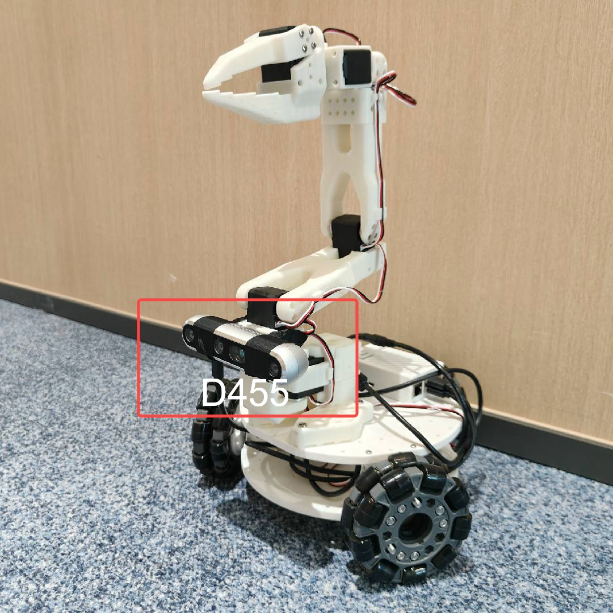

<p align="center">
  <h1 align="center"><strong>LoGoPlanner: Localization Grounded Navigation Policy with Metric-aware Visual Geometry</strong></h1>
  <p align="center">
    <a href='https://steinate.github.io/' target='_blank'>Jiaqi Peng</a>&emsp;
    <a href='https://wzcai99.github.io/' target='_blank'>Wenzhe Cai</a>&emsp;
    <a href='https://yuqiang-yang.github.io/' target='_blank'>Yuqiang Yang</a>&emsp;
    <a href='https://tai-wang.github.io/' target='_blank'>Tai Wang</a>&emsp;
    <a href='https://oa.ee.tsinghua.edu.cn/~shenyuan/' target='_blank'>Yuan Shen</a>&emsp;
    <a href='https://oceanpang.github.io/' target='_blank'>Jiangmiao Pang</a>&emsp;
    <br>
    Tsinghua University&emsp;
    Shanghai AI Laboratory&emsp;
  </p>
</p>

<div align="center">

[](https://steinate.github.io/logoplanner.github.io/)
[](https://arxiv.org/abs/2512.19629/)
[](https://www.youtube.com/watch?v=IlU7pyr9hHY/)
[](https://github.com/InternRobotics/NavDP)
[](https://huggingface.co/datasets/InternRobotics/InternData-N1/)
[](https://github.com/InternRobotics/NavDP)
[](https://github.com/InternRobotics/NavDP)

</div>

# 🏡 Introduction

Most prior end-to-end navigation approaches rely on separate localization modules that require accurate sensor extrinsic calibration for self-state estimation, limiting their generalization across different robot embodiments and environments. To address this, we introduce **LoGoPlanner**, a localization-grounded, end-to-end navigation framework that advances the field by:

1. **Finetuning a long-horizon visual-geometry backbone** to ground predictions with absolute metric scale, enabling implicit state estimation for accurate localization.
2. **Reconstructing surrounding scene geometry** from historical observations to provide dense, fine-grained environmental awareness for reliable obstacle avoidance.
3. **Conditioning the policy** on implicit geometry bootstrapped by the above auxiliary tasks, thereby reducing error propagation and improving robustness.

<div align="center">
    
</div>

# 💻 Simulation

### 🛠️ Installation

We use the same environment as NavDP. Please follow the [installation instructions](https://github.com/InternRobotics/NavDP/blob/master/README.md#%EF%B8%8F-installation) from NavDP to configure the environment:

```bash
conda activate navdp
```

Then install the required packages for the visual geometry model [Pi3](https://github.com/yyfz/Pi3):

```bash
cd baselines/logoplanner
pip install plyfile huggingface_hub safetensors
```

### 🤔 Run the LoGoPlanner Model

Navigate to `baselines/logoplanner` and run the following command to start the server:

```bash
python logoplanner_server.py --port ${YOUR_PORT} --checkpoint ${SAVE_PTH_PATH}
```

### 📊 Evaluation

Open a new terminal and run the evaluation script from the `{NavDP_HOME}` directory:

```bash
conda activate isaaclab
python eval_startgoal_wheeled.py --port {PORT} --scene_dir {ASSET_SCENE} --scene_index {INDEX} --scene_scale {SCALE}
```

<div align="center">
    
</div>

### 😉 Example

```bash
# Start the server
conda activate navdp && python logoplanner_server.py --port 19999 --checkpoint logoplanner_policy.ckpt

# Evaluate on scenes_home
conda activate isaaclab && python eval_startgoal_wheeled.py --port 19999 --scene_dir scenes_home --scene_index 0 --scene_scale 0.01

# Evaluate on cluttered_hard
conda activate isaaclab && python eval_startgoal_wheeled.py --port 19999 --scene_dir cluttered_hard --scene_index 0 --scene_scale 1.0
```

# 🤖 Real-Robot Deployment

<div align="center">
    
</div>

[Lekiwi](https://github.com/SIGRobotics-UIUC/LeKiwi) is a fully open-source robotic car project developed by [SIGRobotics-UIUC](https://github.com/SIGRobotics-UIUC). It includes detailed 3D printing files and operation guides, designed to be compatible with the [LeRobot](https://github.com/huggingface/lerobot/tree/main) imitation learning framework. It also supports the SO101 robotic arm for a complete imitation learning pipeline.

<div align="center">
    
</div>

## 🛠️ Hardware

#### Compute
- Raspberry Pi 5
- Streaming to a laptop

#### Drive
- 3-wheel Kiwi (holonomic) drive with omni wheels

#### Robot Arm (Optional)
- [SO-ARM101](https://github.com/TheRobotStudio/SO-ARM100)

#### Sensors
- RGBD camera (e.g., Intel RealSense D455)

### 1️⃣ 3D Printing

#### Parts
SIGRobotics provides ready-to-print STL files for the 3D-printed parts listed below. These can be printed with generic PLA filament on consumer-grade FDM printers. Refer to the [3D Printing](https://github.com/SIGRobotics-UIUC/LeKiwi/blob/main/3DPrinting.md) section for more details.

| Item | Quantity | Notes |
|:---|:---:|:---:|
| [Base plate Top](https://github.com/SIGRobotics-UIUC/LeKiwi/tree/main/3DPrintMeshes/base_plate_layer2.stl) | 1 | |
| [Base plate Bottom](https://github.com/SIGRobotics-UIUC/LeKiwi/tree/main/3DPrintMeshes/base_plate_layer1.stl) | 1 | |
| [Drive motor mount](https://github.com/SIGRobotics-UIUC/LeKiwi/tree/main/3DPrintMeshes/drive_motor_mount_v2.stl) | 3 | |
| [Servo wheel hub](https://github.com/SIGRobotics-UIUC/LeKiwi/tree/main/3DPrintMeshes/servo_wheel_hub.stl) | 3 | Requires supports<sup>[1](#footnote1)</sup> |
| [Servo controller mount](https://github.com/SIGRobotics-UIUC/LeKiwi/tree/main/3DPrintMeshes/servo_controller_mount.stl) | 1 | |
| [12V Battery mount](https://github.com/SIGRobotics-UIUC/LeKiwi/tree/main/3DPrintMeshes/battery_mount.stl) **or** [12V EU Battery mount](https://github.com/SIGRobotics-UIUC/LeKiwi/tree/main/3DPrintMeshes/battery_mount_eu.stl) **or** [5V Battery mount](https://github.com/SIGRobotics-UIUC/LeKiwi/tree/main/3DPrintMeshes/5v_specific/5v_power_bank_holder.stl) | 1 | |
| [RasPi case Top](https://github.com/SIGRobotics-UIUC/LeKiwi/tree/main/3DPrintMeshes/pi_case_top.stl) | 1 | <sup>[2](#footnote2)</sup> |
| [RasPi case Bottom](https://github.com/SIGRobotics-UIUC/LeKiwi/tree/main/3DPrintMeshes/pi_case_bottom.stl) | 1 | <sup>[2](#footnote2)</sup> |
| Arducam [base mount](https://github.com/SIGRobotics-UIUC/LeKiwi/tree/main/3DPrintMeshes/base_camera_mount.stl) and [wrist mount](https://github.com/SIGRobotics-UIUC/LeKiwi/tree/main/3DPrintMeshes/wrist_camera_mount.stl) | 1 | Compatible with [this camera](https://www.amazon.com/Arducam-Camera-Computer-Without-Microphone/dp/B0972KK7BC) |
| Webcam [base mount](https://github.com/SIGRobotics-UIUC/LeKiwi/tree/main/3DPrintMeshes/webcam_mount/webcam_mount.stl), [gripper insert](https://github.com/SIGRobotics-UIUC/LeKiwi/tree/main/3DPrintMeshes/webcam_mount/so100_gripper_cam_mount_insert.stl), and [wrist mount](https://github.com/SIGRobotics-UIUC/LeKiwi/tree/main/3DPrintMeshes/webcam_mount/webcam_mount_wrist.stl) | 1 | Compatible with [this camera](https://www.amazon.fr/Vinmooog-equipement-Microphone-Enregistrement-conférences/dp/B0BG1YJWFN/) |
| [Modified Follower Arm Base](https://github.com/SIGRobotics-UIUC/LeKiwi/tree/main/3DPrintMeshes/modified_base_arm.stl) | 1 | Use tree supports. **Optional but recommended if you have not built the SO-100 arm** |
| [Follower arm](https://github.com/TheRobotStudio/SO-ARM100) | 1 | |
| [Leader arm](https://github.com/TheRobotStudio/SO-ARM100) | 1 | |

### 2️⃣ Assembly

Refer to the [Assembly](https://github.com/SIGRobotics-UIUC/LeKiwi/blob/main/Assembly.md) guide for detailed instructions.

We also recommend the following detailed tutorial from [seeedstudio](https://wiki.seeedstudio.com/lerobot_lekiwi/) and its accompanying video series:

[](https://www.youtube.com/watch?v=cKWAjEV4aSg)

### 3️⃣ Installation

#### Install LeRobot on Raspberry Pi

1. **Install Miniconda**
    ```bash
    mkdir -p ~/miniconda3
    wget https://repo.anaconda.com/miniconda/Miniconda3-latest-Linux-aarch64.sh -O ~/miniconda3/miniconda.sh
    bash ~/miniconda3/miniconda.sh -b -u -p ~/miniconda3
    rm ~/miniconda3/miniconda.sh
    ```

2. **Restart Shell**
    Run `source ~/.bashrc` (or `source ~/.bash_profile` for Mac, or `source ~/.zshrc` for zsh).

3. **Create and Activate Conda Environment**
    ```bash
    conda create -y -n lerobot python=3.10
    conda activate lerobot
    ```

4. **Clone LeRobot**
    ```bash
    git clone https://github.com/huggingface/lerobot.git ~/lerobot
    ```

5. **Install FFmpeg**
    ```bash
    conda install ffmpeg -c conda-forge
    ```

6. **Install LeRobot with LeKiwi Dependencies**
    ```bash
    cd ~/lerobot && pip install -e ".[lekiwi]"
    ```

#### Install LeRobot on Laptop/PC

Follow the same steps as above for the Raspberry Pi installation.

#### Install RealSense SDK on Raspberry Pi

Refer to [this guide](https://docs.ros.org/en/humble/p/librealsense2/doc/installation_raspbian.html).

1. **Check System Version**
    ```bash
    uname -a
    ```

2. **Increase Swap Size**
    ```bash
    sudo vim /etc/dphys-swapfile
    # Set CONF_SWAPSIZE=2048
    sudo /etc/init.d/dphys-swapfile restart
    swapon -s
    ```

3. **Install Required Packages**
    ```bash
    sudo apt-get install -y libdrm-amdgpu1 libdrm-dev libdrm-exynos1 libdrm-freedreno1 libdrm-nouveau2 libdrm-omap1 libdrm-radeon1 libdrm-tegra0 libdrm2
    sudo apt-get install -y libglu1-mesa libglu1-mesa-dev glusterfs-common libglui-dev libglui2c2
    sudo apt-get install -y mesa-utils mesa-utils-extra xorg-dev libgtk-3-dev libusb-1.0-0-dev
    ```

4. **Update Udev Rules**
    ```bash
    cd ~
    git clone https://github.com/IntelRealSense/librealsense.git
    cd librealsense
    sudo cp config/99-realsense-libusb.rules /etc/udev/rules.d/
    sudo udevadm control --reload-rules && udevadm trigger
    ```

5. **Build and Install librealsense**
    ```bash
    cd ~/librealsense
    mkdir build && cd build
    cmake .. -DBUILD_EXAMPLES=true -DCMAKE_BUILD_TYPE=Release -DFORCE_LIBUVC=true
    make -j1
    sudo make install
    ```

6. **Install Python Bindings**
    ```bash
    cd ~/librealsense/build
    cmake .. -DBUILD_PYTHON_BINDINGS=bool:true -DPYTHON_EXECUTABLE=$(which python3)
    make -j1
    sudo make install
    ```

7. **Add to Python Path**
    Edit `~/.zshrc` (or your shell config file) and add:
    ```bash
    export PYTHONPATH=$PYTHONPATH:/usr/local/lib
    ```
    Then run `source ~/.zshrc`.

8. **Test the Camera**
    ```bash
    realsense-viewer
    ```

### 4️⃣ Motor Configuration

To identify the port for each bus servo adapter, run:
```bash
lerobot-find-port
```
Example output:
```bash
Finding all available ports for the MotorBus.
['/dev/ttyACM0']
Remove the USB cable from your MotorsBus and press Enter when done.

[...Disconnect the corresponding leader or follower arm and press Enter...]

The port of this MotorsBus is /dev/ttyACM0
Reconnect the USB cable.
```

> **Note:** Remember to disconnect the USB cable before pressing Enter, otherwise the interface may not be detected.

On Linux, grant access to the USB ports:
```bash
sudo chmod 666 /dev/ttyACM0
sudo chmod 666 /dev/ttyACM1
```

Run the following command to set up the motors for LeKiwi. This will configure the arm motors (IDs 6–1) followed by the wheel motors (IDs 9, 8, 7).
```bash
lerobot-setup-motors \
    --robot.type=lekiwi \
    --robot.port=/dev/ttyACM0  # Use the port found in the previous step
```

<div align="center">
    
</div>

### 5️⃣ Teleoperation

SSH into your Raspberry Pi, activate the conda environment, and run:
```bash
python -m lerobot.robots.lekiwi.lekiwi_host --robot.id=my_awesome_kiwi
```

On your laptop (also with the `lerobot` environment active), run the teleoperation example after setting the correct `remote_ip` and `port` in `examples/lekiwi/teleoperate.py`:

<div align="center">
    
</div>

```bash
python examples/lekiwi/teleoperate.py
```

You should see a connection message on your laptop. You can then:
- Move the leader arm to control the follower arm.
- Use **W, A, S, D** to drive forward, left, backward, right.
- Use **Z, X** to turn left/right.
- Use **R, F** to increase/decrease the robot speed.


### 6️⃣ Deployment Preparation

Mount the RGBD camera onto LeKiwi and adjust the SO101 arm to avoid obstructing the camera view.

<div align="center">
    
</div>

> **Tip:** Before running the navigation algorithm, test the robot by having it follow simple trajectories (e.g., a sine wave or "S" curve) to ensure the MPC tracking is working correctly.

### 7️⃣ Deploy LoGoPlanner

On your laptop or PC, start the LoGoPlanner server:
```bash
python logoplanner_realworld_server.py --port 19999 --checkpoint ${CKPT_PATH}
```

Verify the server IP address:
```bash
hostname -I
```

On the Raspberry Pi, copy `lekiwi_logoplanner_host.py` to your working directory and run the client:
```bash
conda activate lerobot
python lekiwi_logoplanner_host.py --server-url http://192.168.1.100:8888 --goal-x 10 --goal-y -2
```

The robot will navigate to the target coordinates (10, -2). Without any external odometry module, it will use its implicit localization to reach the goal and stop.

---

**Footnotes:**

<a name="footnote1">1</a>: Requires 3D printing supports.  
<a name="footnote2">2</a>: Raspberry Pi case parts.